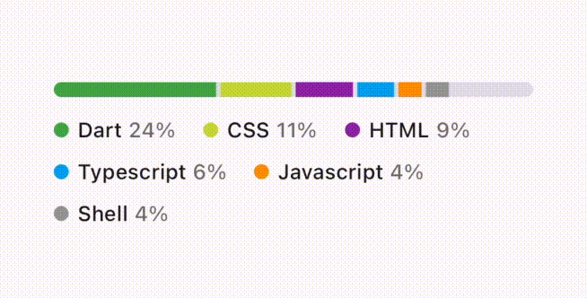
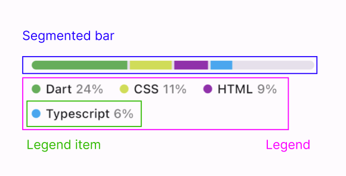
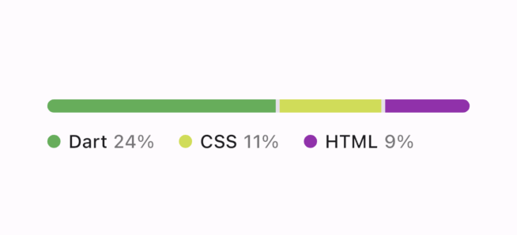
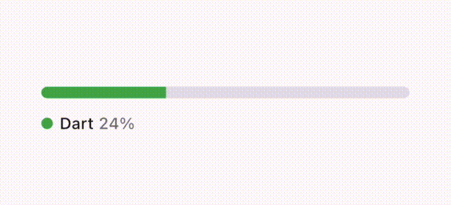
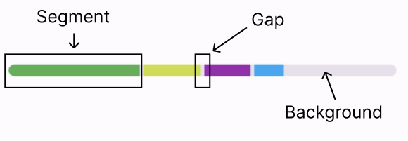
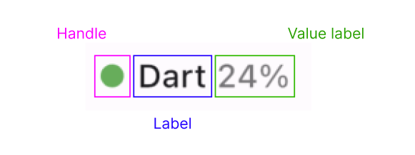

[](https://pub.dev/packages/primer_progress_bar) [](https://pub.dev/packages/primer_progress_bar) [](https://fujidaiti.github.io/primer_progress_bar/#/) [](https://pub.dev/documentation/primer_progress_bar/latest/)

<br/>

<div align="center">

<h3 align="center">PrimerProgressBar</h3>
  <p align="center">
    Unoffcial Flutter implementation of the progress bar <br />defined in <a href="https://primer.style/design/components/progress-bar">GitHub Primer Design System</a>.
    <br />
    <br />
    <a href="https://pub.dev/documentation/primer_progress_bar/latest/"><strong>Explore the docs »</strong></a>
    <br />
    <br />
    <a href="https://fujidaiti.github.io/primer_progress_bar/#/">View Demo</a>
    ·
    <a href="https://github.com/fujidaiti/primer_progress_bar/issues?q=is%3Aopen+label%3Abug+sort%3Aupdated-desc">Report Bug</a>
    ·
    <a href="https://github.com/fujidaiti/primer_progress_bar/issues?q=is%3Aopen+label%3Aenhancement+sort%3Aupdated-desc">Request Feature</a>
  </p>
</div>
<br/>

<br/>

## Installation

Add this package to your `pubspec.yaml`.

```yaml
dependencies:
  primer_progress_bar: ^0.2.0
```

Alternatively, you can use `flutter` command like:

```shell
flutter pub add primer_progress_bar
```


## Getting Started

Define segments to be displayed in the progress bar using `Segment`:

```dart
final segments = [
  Segment(color: Colors.green, value: 24, 
          label: Text("Dart"), formattedValue: Text("24%")),
  Segment(color: Colors.lime, value: 11, 
          label: Text("CSS"), formattedValue: Text("11%")),
  ...
];
```

Then, in your `build` method:

```dart
Widget build(BuildContext context) {
  // Make sure the sum of the `segment.value`s is <= `maxTotalValue`.
  return PrimerProgressBar(segments: segments, maxTotalValue: 100);
}
```


## Usage

### Components



The [Primer](https://github.com/primer)'s progress bar consists of 3 components: the *segmented bar*, the *legend*, and the *legend item*s. The progress bar can display multiple colored segments in a horizontal bar, and the legend is placed below the bar with the aligned descriptions of each segment.

You can define a segment using [Segment](https://pub.dev/documentation/primer_progress_bar/latest/primer_progress_bar/Segment-class.html):

```dart
Segment(color: Colors.lightBlue, value: 24, 
        label: Text("Dart"), formattedValue: Text("24%"));
```

The `value` describes the amount of space the segment occupies in the entier bar (see [Proportion of segments](#proportion-of-segments) section), and the `label` and `formattedValue` are the texts used in the legend to explain what the segment means.

The [PrimerProgressBar](https://pub.dev/documentation/primer_progress_bar/latest/primer_progress_bar/PrimerProgressBar-class.html) integrates these 3 components and provides a simple interface to create a chart like the one above, so it should fit to general usecases. However, since each component is modulated, it is easy to use them individually for your own purposes. See [SegmentedBar](https://pub.dev/documentation/primer_progress_bar/latest/primer_progress_bar/SegmentedBar-class.html), [SegmentedBarLegend](https://pub.dev/documentation/primer_progress_bar/latest/primer_progress_bar/SegmentedBarLegend-class.html), [LegendItem](https://pub.dev/documentation/primer_progress_bar/latest/primer_progress_bar/LegendItem-class.html) for more details usage of each component.


### Proportions of segment sizes

The proportion of each segment size to the bar length is determined by dividing the [maxTotalValue](https://pub.dev/documentation/primer_progress_bar/latest/primer_progress_bar/PrimerProgressBar/maxTotalValue.html) according to the `value`s of the segments.  For example, if you want to display the percentage of each programming language used in a project,  the `value` could be the percentage for a language and the `maxTotalValue` is 100.

```dart
PrimerProgressBar(segments: segments, maxTotalValue: 100);
```

Then, the size of a segment with a `value` of 24, for example, should be the 24% of the bar length.


If `maxTotalValue` is not specified, it is implicitly set to the sum of the `value`s of the segments, resulting in the segments always filling the entire bar.




### Limit legend lines

By default, the legend tries to align all the items while growing in vertical direction.  This is fine if the legend has a relatively small number of items to display, but if you have a large number of segments, you will end up with a verbose legend.



For these cases, the legend provides a way to limit the number of lines in which the items are aligned. The following example limits the number of lines in the legend to 2.

```dart
PrimerProgressBar(
  segments: segments,
  // Limits the number of the lines in the legend to 2.
  legendStyle: const SegmentedBarLegendStyle(maxLines: 2),
  // A builder of a legend item that represent the overflowed items.
  // `truncatedItemCount` is the number of items that is overflowed.
  ellipsisBuilder: (truncatedItemCount) {
    final value = segments
        .skip(segments.length - truncatedItemCount)
        .fold(0, (accValue, segment) => accValue + segment.value);
    return LegendItem(
      segment: Segment(
        value: value,
        color: Colors.grey,
        label: const Text("Other"),
        formattedValue: Text("$value%"),
      ),
    );
  },
);
```

If the legend failed to align some items within the given line limit, the overflowing items are not shown and instead an item that is created by [ellipsisBuilder](https://pub.dev/documentation/primer_progress_bar/latest/primer_progress_bar/PrimerProgressBar/legendEllipsisBuilder.html) (called an *ellipsis*) is displayed as the last item in the legend.


### Styling

The appearace of the 3 components are configurable with [SegmentedBarStyle](https://pub.dev/documentation/primer_progress_bar/latest/primer_progress_bar/SegmentedBarStyle-class.html), [SegmentedBarLegendStyle](https://pub.dev/documentation/primer_progress_bar/latest/primer_progress_bar/SegmentedBarLegendStyle-class.html), [LegendItemStyle](https://pub.dev/documentation/primer_progress_bar/latest/primer_progress_bar/LegendItemStyle-class.html), respectively. The documentation will provide detailed descriptions of each class and its properties, while our focus here is on briefly explaining the terminology used in the documentation.

#### Segmented bar

- **Gap** : A space between adjacent segments.
- **Background** : The color of the bar itself.



#### Legend item

- **Handle** : A small shape filled with the segment's color and placed at the start of the item.
- **Label** : A text explaining what the segment means.
- **Value label** : A formatted `value` of the segment.




## TODO

- [ ] Add tests
- [ ] Support mouse hovering


## Contributing

Contributions are what make the open source community such an amazing place to learn, inspire, and create. Any contributions you make are **greatly appreciated**.

If you have a suggestion that would make this better, please fork the repo and create a pull request. You can also simply open an issue with the tag "enhancement".
Don't forget to give the project a star! Thanks again!

1. Fork the Project
2. Create your Feature Branch (`git checkout -b feature/AmazingFeature`)
3. Commit your Changes (`git commit -m 'Add some AmazingFeature'`)
4. Push to the Branch (`git push origin feature/AmazingFeature`)
5. Open a Pull Request


## Thanks

* [Best-README-Template](https://github.com/othneildrew/Best-README-Template/tree/master) by [@othneildrew](https://github.com/othneildrew)
* [Primer Design System](https://github.com/primer) by [@github](https://github.com/github)

